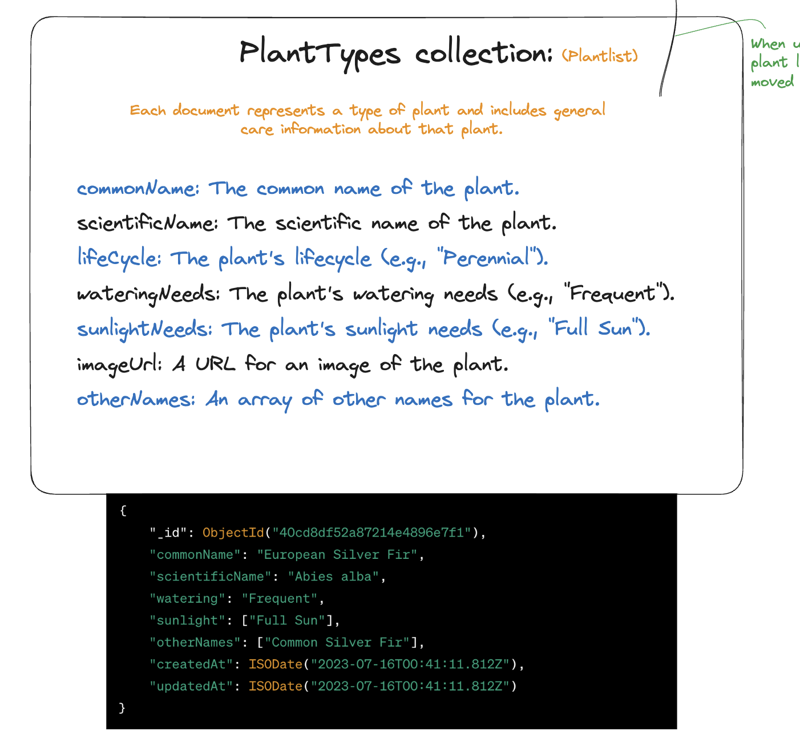
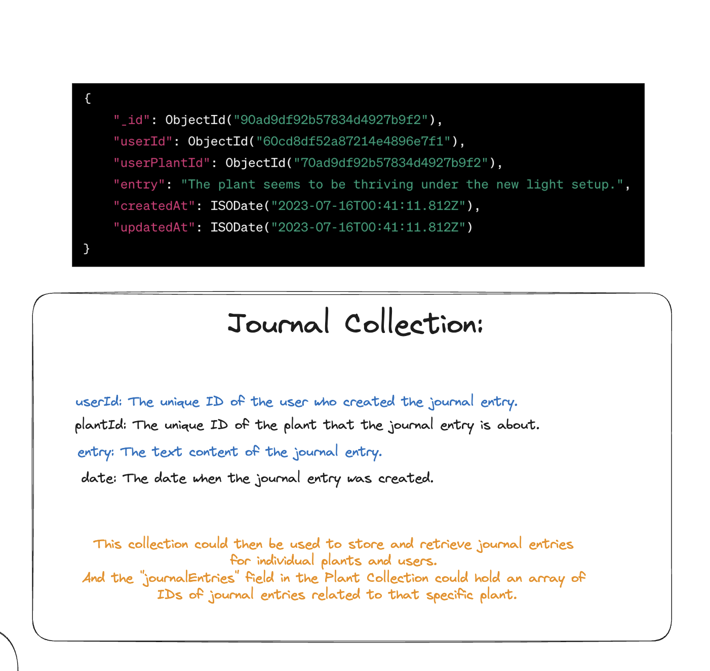
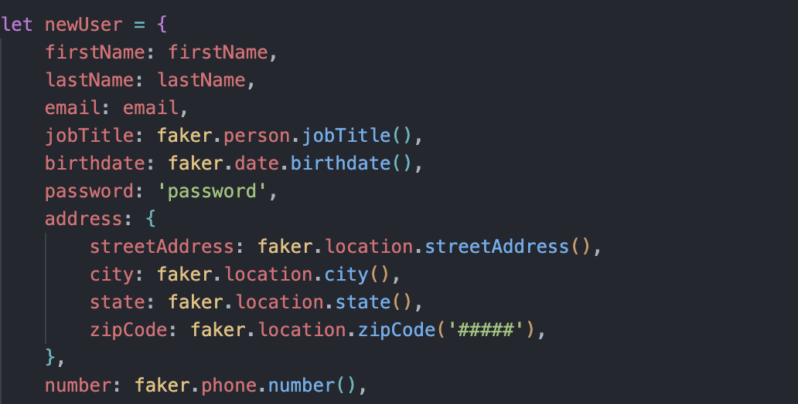
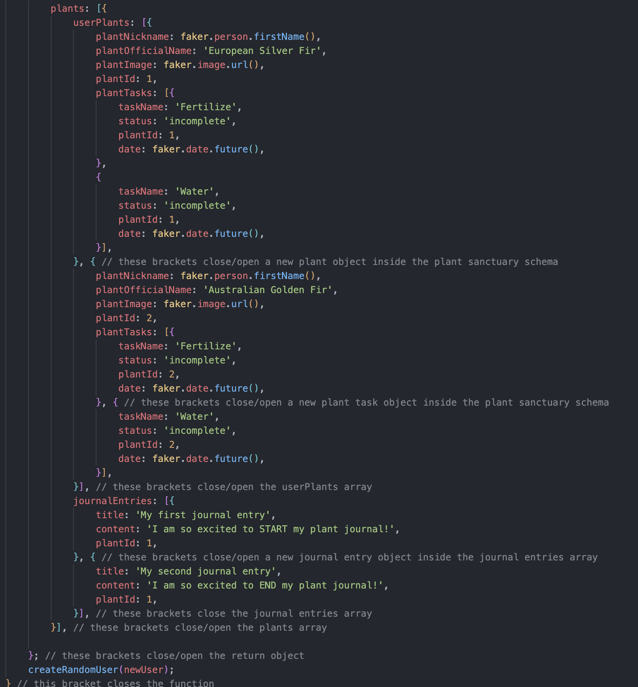

# Okay Bloomer Server

## Introduction

Welcome to the Okay Bloomer API. This API is created to help seed, store and call on our data when we need it for the website.

## Wireframe

This is what is inside the User Model

===================================================

This is what is inside the tasks collection where we plan to have it embedded into the userPlants collection

===================================================

This is what is inside the userPlant collection where we plan to have it embedded inside the User Schema

===================================================

This is a plantType schema that is embedded inside the userPlants collection

This is a journal schema that is embedded inside the userPlants collection

# Code that we're proud of:

Yes, this is all in one function. This is what we created for our user in order to create our user with the user model. This took multiple tests

# Developed By:

**Jonathan Davila:** Full-Stack Development
**Jessica Lee:** Front-End Development
**Caleb-Joshua Monzon:** Back-End Development
**Sydney Pogue:** Full-Stack Development
